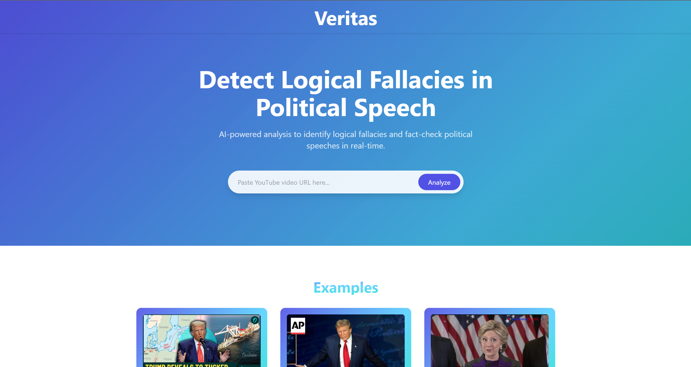
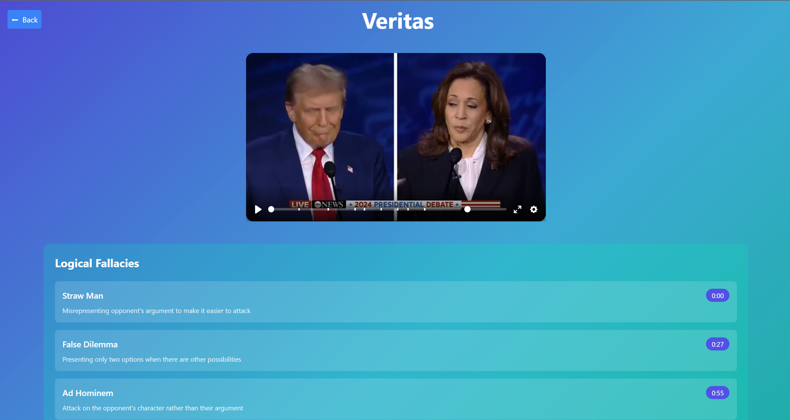

# \_geekathon\_ Leiria 2024

## 💪 Team: Hacktastic

## Veritas: A fact-checker and logical fallacy Detector

Detect logical fallacies and fact-check speeches in real time!
This application analyzes videos of news and political figures' speeches, identifying logical fallacies and verifying the accuracy of claims.

🚀 **[Live Demo](http://44.244.174.51:3000)** ✨ ✨ ( :warning: This URL is not reachable from the BlackBox WiFi!! :warning: )

|                                       |                                       |
| ------------------------------------- | ------------------------------------- |
|  |  |

---

## 🎯 Problem Statement

In today's world, misinformation and logical fallacies are rampant. It is challenging for the average person to discern the truth from falsehoods in political speeches and news reports. This leads to a lack of trust in the media and public figures, as well as the spread of misinformation. Our application aims to address this issue by providing a tool that can analyze videos of speeches, identify logical fallacies, and fact-check claims made by public figures.

## 🧠 Features

- **Real-Time Analysis**: Analyze videos in real-time and provide instant feedback with time markers.
- **Logical Fallacy Detection**: Identify common fallacies like **strawman**, **ad hominem**, **false dilemmas**, and more.
- **Fact-Checking**: Validate claims made in speeches using trusted data sources.
- **Video Analysis**: Upload or link to videos for comprehensive analysis.
- **Visual Results**: Intuitive app to display fallacy types and fact-check outcomes.

---

## 🔧 Technologies Used

- **Frontend**: React.js
- **Backend**: Python FastAPI
- **Machine Learning**: Python, AWS Bedrock, Claude 3.1 Sonnet
- **Data stores**: AWS S3
- **Deployment**: Docker, AWS EC2

---

## 🌟 How It Works

1. Upload a video or provide a video link.
2. The app processes the speech using speech-to-text APIs.
3. Large Language Models detect logical fallacies in the transcript.
4. Fact-checking is performed against credible sources using custom models.
5. Results are displayed in an interactive dashboard.

---

## 📚 Usage

1. Access the live application: [http://44.244.174.51:3000](http://44.244.174.51:3000).
2. Upload a video or paste a URL.
3. View the analysis report, including fallacies and fact-check results.

---

## 🚀 Future Enhancements

- Add support for live-stream analysis.
- Expand the library of logical fallacies.
- Integrate additional fact-checking APIs.
- Support multiple languages.
- Expand support for analyzing Twitter and other social media content.

---

## Software components

- **Frontend Application**: [hacktasticgeekathon/WebApp](https://github.com/hacktasticgeekathon/webapp)
- **Backend API**: [hacktasticgeekathon/BackendAPI](https://github.com/hacktasticgeekathon/backendapi)
- **Fallacy Detection API**: [hacktasticgeekathon/fallacy-detection](https://github.com/hacktasticgeekathon/fallacydetectionApi)

### Created with ❤️ at \_geekathon\_
